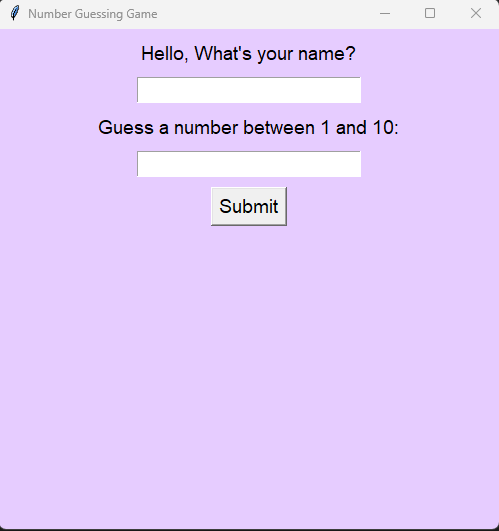
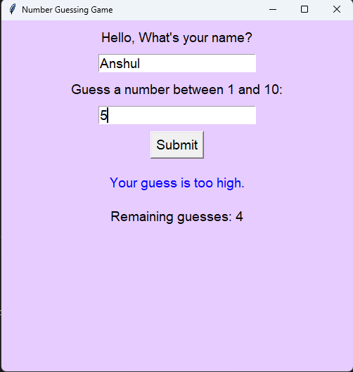
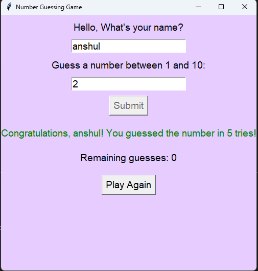
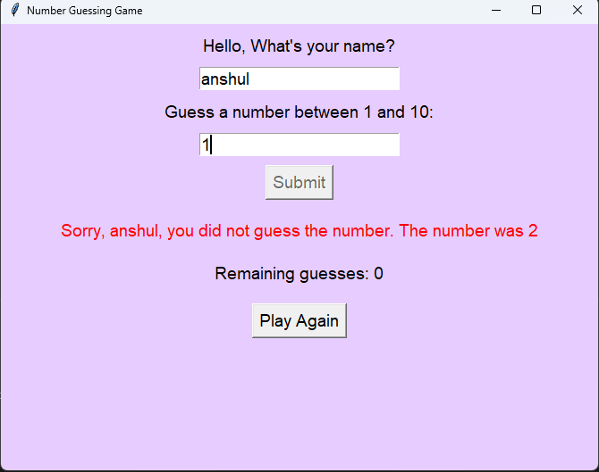

# Number Guessing Game



## Why We Made This
The Number Guessing Game is a simple yet entertaining application created for users to guess a randomly generated number within a specified range. This project was developed to provide a fun way for users to test their guessing skills while also familiarizing themselves with basic GUI (Graphical User Interface) programming concepts using Tkinter in Python.

## Functionality
- **Player Interaction**: The game prompts the player to enter their name and guess a number between 1 and 10.
- **Validation**: Input validation ensures that the entered name consists only of alphabetic characters and that the guessed number falls within the specified range.
- **Feedback**: Provides feedback on whether the guess is too high, too low, or correct.
- **Remaining Guesses**: Displays the number of remaining guesses out of the total allowed.
- **Game Over Handling**: Handles game over scenarios such as guessing the correct number or exceeding the maximum number of guesses.
- **Play Again**: Allows the player to reset the game and play again.

## How It Works
1. The game initializes by generating a random number between 1 and 10.
2. The player is prompted to enter their name and guess a number.
3. Upon submitting a guess, the game validates the input and provides feedback.
4. If the guess is correct, the player is congratulated, and the game ends.
5. If the guess is incorrect, the player is informed whether the guess is too high or too low.
6.  The player can continue guessing until they either guess the correct number or    exhaust  all allowed guesses.
7. After the game ends, the player has the option to play again.

## Use Case
The Number Guessing Game serves as a recreational activity suitable for various scenarios, including:
- Icebreaker activities in social gatherings or team-building events.
- Educational purposes to introduce basic GUI programming concepts.
- Personal entertainment to pass the time with a simple yet engaging game.

## Features
- **Simple GUI**: The game features a straightforward graphical interface built using Tkinter.
- **Input Validation**: Ensures that user input adheres to the specified format and range.
- **Dynamic Feedback**: Provides real-time feedback on the player's guesses.
- **Game Over Handling**: Handles different game over scenarios gracefully.
- **Play Again Option**: Allows players to reset the game and play multiple rounds.

## Installation
1. Clone the repository:

```
git clone https://github.com/LousyCake/number-guessing-game.git
```

2. Run the script:

```
python number_guessing_game_gui.py
```

## Screenshots




## Dependencies

The Number Guessing Game has the following dependencies:
- Python 3.x
- Tkinter (usually included with Python distributions)

## Code Explanation
The code for the Number Guessing Game is structured as follows:

- `NumberGuessingGame`: This class defines the main application window and handles the game logic.
- `validate_name`: This method is used for input validation to ensure that only alphabetic characters are entered for the player's name.
- `check_guess`: This method checks the player's guess against the randomly generated number and provides feedback.
- `clear_message`: This method clears the message label in the GUI.
- `reset_game`: This method resets the game state to allow the player to play again.

## License
This project is licensed under the MIT License. See the [LICENSE](LICENSE) file for details.
